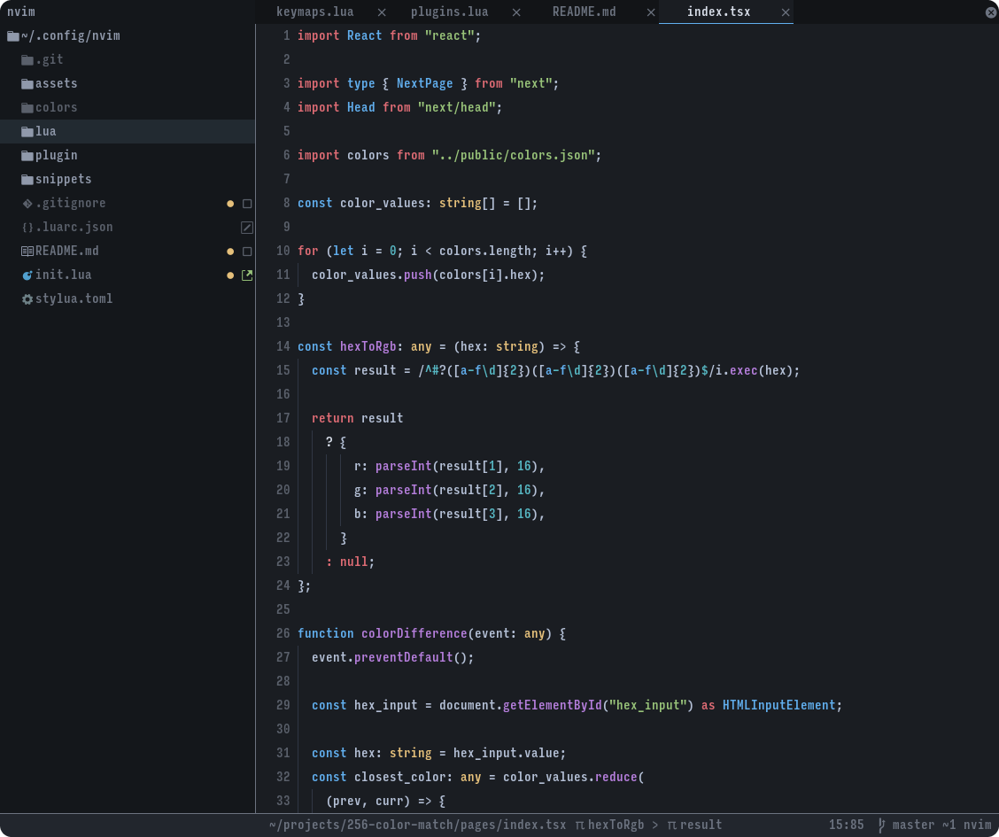

| Plugins                                                                                         | Description                    |
| ----------------------------------------------------------------------------------------------- | ------------------------------ |
| [wbthomason/packer.nvim](https://github.com/wbthomason/packer.nvim)                             | Plugin Manager                 |
| [nvim-lpsconfig](https://github.com/nvim-lpsconfig)                                             | Built-in LSP interface         |
| [folke/trouble.nvim](https://github.com/folke/trouble.nvim)                                     | Pretty diagnostics             |
| [nvim-treesitter/nvim-treesitter](https://github.com/nvim-treesitter/nvim-treesitter)           | Built-in tree-sitter interface |
| [jose-elias-alvarez/null-ls.nvim](https://github.com/jose-elias-alvarez/null-ls.nvim)           | Inject LSP actions             |
| [jose-elias-alvarez/nvim-lsp-ts-utils](https://github.com/jose-elias-alvarez/nvim-lsp-ts-utils) | Typescript utilities           |
| [windwp/nvim-autopairs](https://github.com/windwp/nvim-autopairs)                               | Pair completion                |
| [hrsh7th/nvim-cmp](https://github.com/hrsh7th/nvim-cmp)                                         | Completion engine              |
| [L3MON4D3/LuaSnip](https://github.com/L3MON4D3/LuaSnip)                                         | Snippet engine                 |
| [akinsho/toggleterm.nvim](https://github.com/akinsho/toggleterm.nvim)                           | Integrated terminal            |
| [nvim-lua/plenary.nvim](https://github.com/nvim-lua/plenary.nvim)                               | Utility lua functions          |
| [lewis6991/gitsigns.nvim](https://github.com/lewis6991/gitsigns.nvim)                           | Git integration                |
| [kyazdani42/nvim-web-devicons](https://github.com/kyazdani42/nvim-web-devicons)                 | Icons                          |
| [kylechui/nvim-surround](https://github.com/kylechui/nvim-surround)                             | Surround motions               |
| [nvim-neo-tree/neo-tree.nvim](https://github.com/nvim-neo-tree/neo-tree.nvim)                   | File explorer                  |
| [folke/which-key.nvim](https://github.com/folke/which-key.nvim)                                 | Keystroke based commands       |
| [lukas-reineke/indent-blankline.nvim](https://github.com/lukas-reineke/indent-blankline.nvim)   | Indent markers                 |
| [SmiteshP/nvim-navic](https://github.com/SmiteshP/nvim-navic)                                   | Code depth indication          |
| [akinsho/bufferline.nvim](https://github.com/akinsho/bufferline.nvim)                           | Bufferline                     |
| [nvim-telescope/telescope.nvim](https://github.com/nvim-telescope/telescope.nvim)               | Fuzzy finder                   |
| [numToStr/Comment.nvim](https://github.com/numToStr/Comment.nvim)                               | Comment motions                |
| [Vonr/align.nvim](https://github.com/Vonr/align.nvim)                                           | Align motions                  |
| [Vonr/align.nvim](https://github.com/Vonr/align.nvim)                                           | Align motions                  |
| [lervag/vimtex](https://github.com/lervag/vimtex)                                               | Comoplie tex documents         |
| [iamcco/markdown-preview.nvim](https://github.com/iamcco/markdown-preview.nvim)                 | Live reload of markdown files  |
